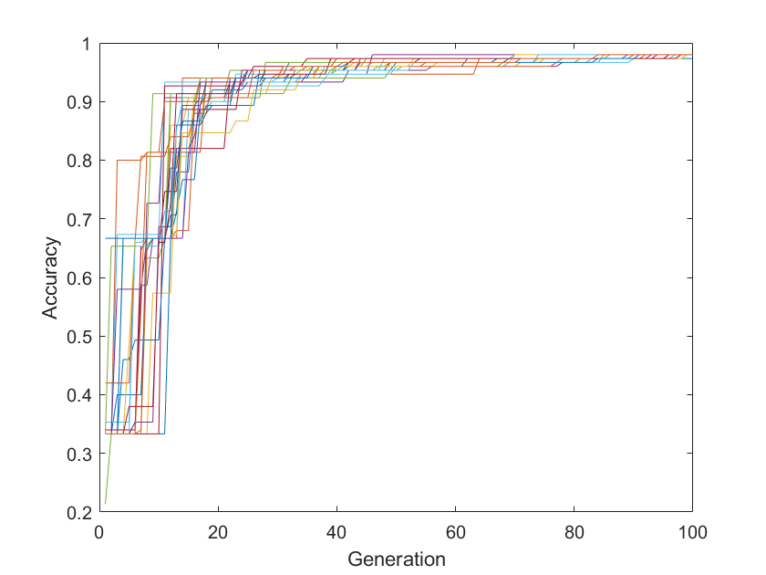

# CPU (Sequential) Neural Network using DEGA (Prototype)

The goal of this folder is to provide research students with a prototype for the use of a Differential Evolution (DE) Genetic Algorithm for the weights and bias value optimization.

The Differential Evolution algorithm employed is published here:

* M. R. Smith, F.-A. Kuo, C.-W. Hsieh, J.-P. Yu, J.-S. Wu, and A. Ferguson, Rapid optimization of blast wave mitigation strategies using Quiet Direct Simulation and Genetic Algorithm, Computer Physics Communications, Volume 181, Issue 6,
2010,
Pages 1025-1036,
ISSN 0010-4655,
https://doi.org/10.1016/j.cpc.2010.02.009.

The main inputs for this solver are:

* The shape and structure of the neural network being used; this is identical to the base network used in the other examples in this repository,
* The number of children - this is the population of the DEGA (currently 30).
* Sigma - this is tied to the scale of the mutation in the genetic algoritm, and
* FR - this is for scaling and super-convergence; less than 1 means to slow down (i.e. be more conservative, to a point though - take care) while greater than 1 will attempt to make children more like the fitter parent.

Increasing Sigma reduces the chance of the algorithm getting trapped in a local minima, but slow convergence. Increasing FR past 1 will often result in faster convergence - at the risk of getting trapped in a local minima. **There is no free lunch**.

The main variables for the DEGA solver are contained in the ga_nn.h file:

```C
#define NO_CHILDREN 30
#define SIGMA 0.75
#define FR 0.75
```


## Details

The neural network described with this example contains 12 neurons (numbered 0 to 11) connected by a network with 35 weights applied to said connections, as shown below:


There are:

* 4 input nodes (0-3), and
* 3 output nodes (nodes 9, 10 and 11).
* a single hidden layer with 5 nodes (4-8).

The data used for this demonstration is the Iris data set, based on data collected by Fisher in 1936. This set has been used for decades to test classification and data analysis techniques. (References on the main README file)

The Iris data set has 4 continuous input variables:
* sepal length,
* sepal width,
* petal length, and
* petal width.

Provided with each of these is a classification: Iris Setosa, Iris Versicolour, or Iris Virginica.

### Warning! ###

In spectactulary bad form, this demonstration loads the entire set and uses it for training - after which it randomly selects one of the data points and checks if the classification was successful. Normally, one might expect that a fraction of the sample data set is exempted from the training set for proper testing.

## Running the code

Navigate to the src directory and run:

```bash
make && ./main.exe
```

Running this code generates 3 files:

* Accuracy.txt - contains the training accuracy vs epoch number,
* Weights.txt - contains the weights on the network, and
* Bias.txt - contains the bias values of the neurons.

## Expected Output

The method is stochastic - as random variables are assigned to initial weights and bias values - but your results may look something like this.

### Accuracy during Training

For a single run; we would typically do this many times and take the average:

Typical output:

```bash
=======================================
Checking randomly selected sample 115
Expected outputs = 0, 0, 1
Measured outputs = 1.02388e-18, 7.02358e-07, 1
Predicted output successfully
```


