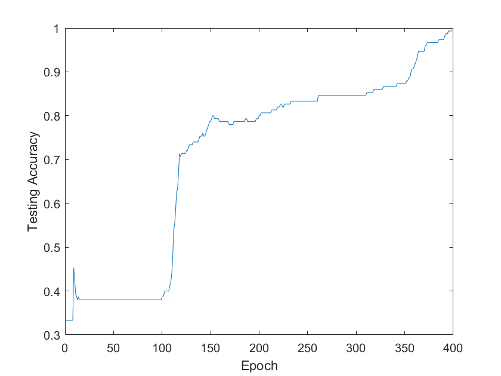
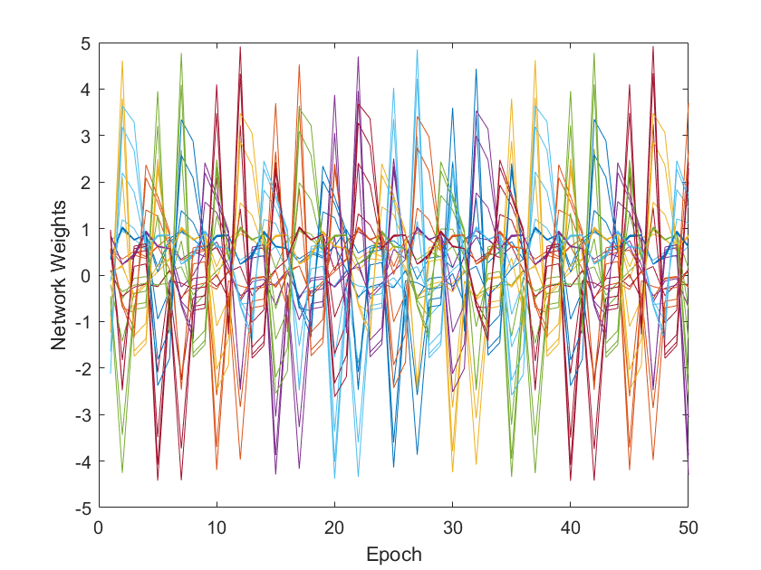
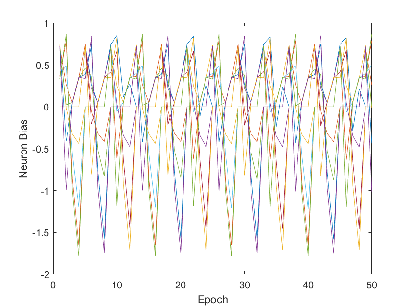

# CPU (Prototype)

The goal of this folder is to provide research students with a first stop for working with neural networks before moving onto parallel compute or numerical method strategies.

## Details

The neural network described with this example contains 12 neurons (numbered 0 to 11) connected by a network with 35 weights applied to said connections, as shown below:


There are:

* 4 input nodes (0-3), and
* 3 output nodes (nodes 9, 10 and 11).
* a single hidden layer with 5 nodes (4-8).

The data used for this demonstration is the Iris data set, based on data collected by Fisher in 1936. This set has been used for decades to test classification and data analysis techniques. (References on the main README file)

The Iris data set has 4 continuous input variables:
* sepal length,
* sepal width,
* petal length, and
* petal width.

Provided with each of these is a classification: Iris Setosa, Iris Versicolour, or Iris Virginica.

### Warning! ###

In spectactulary bad form, this demonstration loads the entire set and uses it for training - after which it randomly selects one of the data points and checks if the classification was successful. Normally, one might expect that a fraction of the sample data set is exempted from the training set for proper testing.

## Running the code

Navigate to the src directory and run:

```bash
make && ./main.exe
```

Running this code generates 3 files:

* Accuracy.txt - contains the training accuracy vs epoch number,
* Weights.txt - contains the weights on the network, and
* Bias.txt - contains the bias values of the neurons.

## Expected Output

The method is stochastic - as random variables are assigned to initial weights and bias values - but your results may look something like this:

### Accuracy during Training

For a single run; we would typically do this many times and take the average:



### Weight values



### Bias values

